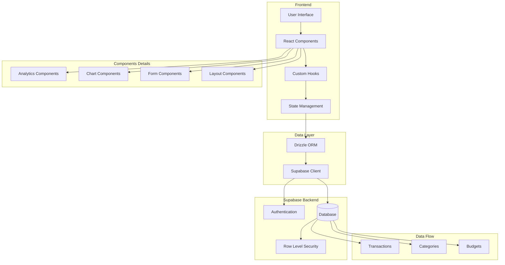
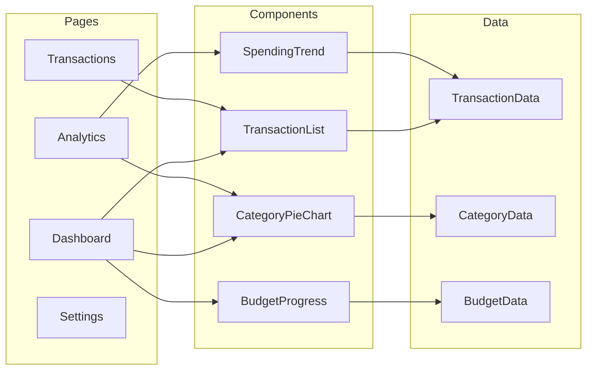

# WiseBill Architecture

```mermaid
graph TD
    subgraph Frontend
        UI[User Interface]
        Components[React Components]
        Hooks[Custom Hooks]
        State[State Management]
    end

    subgraph Data Layer
        Drizzle[Drizzle ORM]
        Supabase[Supabase Client]
    end

    subgraph Backend [Supabase Backend]
        Auth[Authentication]
        DB[(Database)]
        RLS[Row Level Security]
    end

    UI --> Components
    Components --> Hooks
    Hooks --> State
    State --> Drizzle
    Drizzle --> Supabase
    Supabase --> Auth
    Supabase --> DB
    DB --> RLS

    %% Component Details
    subgraph Components Details
        Analytics[Analytics Components]
        Charts[Chart Components]
        Forms[Form Components]
        Layout[Layout Components]
    end

    Components --> Analytics
    Components --> Charts
    Components --> Forms
    Components --> Layout

    %% Data Flow
    subgraph Data Flow
        Transactions[Transactions]
        Categories[Categories]
        Budgets[Budgets]
    end

    DB --> Transactions
    DB --> Categories
    DB --> Budgets
```

## Component Dependencies

```mermaid
flowchart LR
    subgraph Pages
        Dashboard
        Transactions
        Analytics
        Settings
    end

    subgraph Components
        TransactionList
        CategoryPieChart
        BudgetProgress
        SpendingTrend
    end

    subgraph Data
        TransactionData
        CategoryData
        BudgetData
    end

    Dashboard --> TransactionList
    Dashboard --> CategoryPieChart
    Dashboard --> BudgetProgress
    
    Analytics --> SpendingTrend
    Analytics --> CategoryPieChart
    
    Transactions --> TransactionList
    
    TransactionList --> TransactionData
    CategoryPieChart --> CategoryData
    BudgetProgress --> BudgetData
    SpendingTrend --> TransactionData
``` 